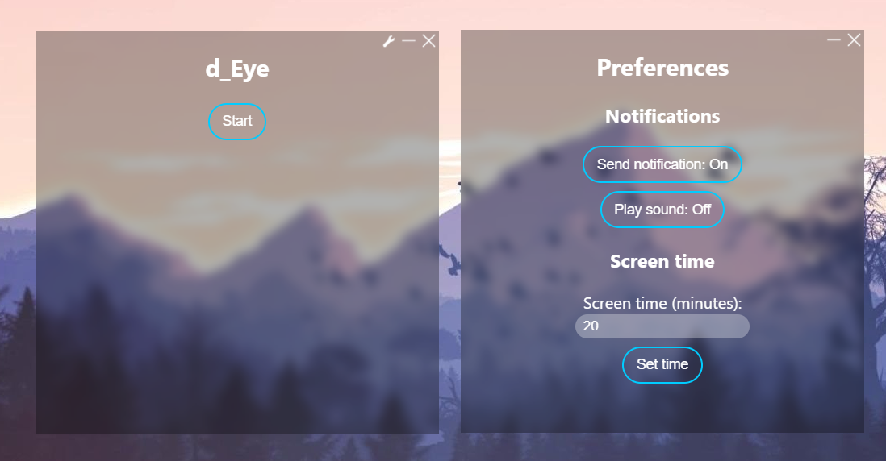

# d_Eye
d_Eye is an eye reminder app.  
  
  

## Features
- Modern UI with blurred background
- Adjustable screen time
- Play sound and send notification when it's break time

## Features to be added
- Close button minimizes to tray preference
- Custom notification sound support
- Run at startup preference
- Disable tray icon preference
- Auto updater

## Build from source

### Prerequisites
- [Node.js and NPM](https://nodejs.org)
- [node-gyp](https://github.com/nodejs/node-gyp#readme) and the build tools for your OS
- [Git](https://git-scm.com) (Optional)

### Building
1. Clone the repository with `https://github.com/daydreamercodes/d_Eye.git` if you have Git installed or download ZIP and extract.
2. Open a command line in the source folder and install dependencies with `npm i`.
3. If you are not on Windows, configure package.json for your OS (Get help from [Electron Builder documentation](https://www.electron.build/configuration/configuration)).
4. Start building with `npm run build`.

### Running from source without building
1. Clone the repository with `https://github.com/daydreamercodes/d_Eye.git` if you have Git installed or download ZIP and extract.
2. Open a command line in the source folder and install dependencies with `npm i`.
3. Run d_Eye with `npm run start`.
